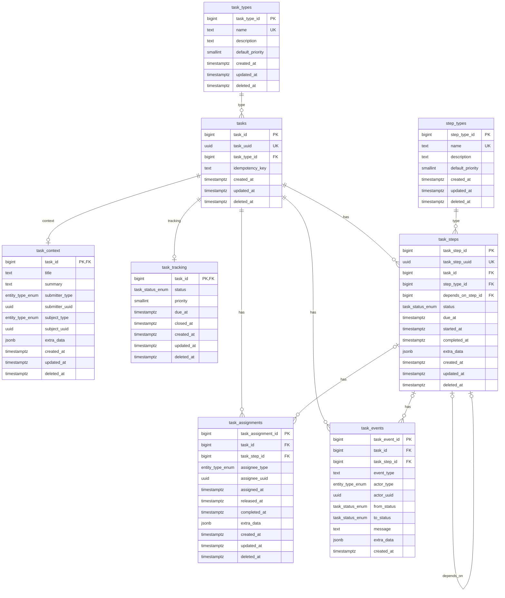

# task-internal

Lightweight task and workflow tracking. A "production Jira" for correlated activity across services: anything that crosses multiple data stores or services under one logical operation can have a `tasks` row tying it together. The root `tasks` row stays intentionally thin; optional `task_context` and `task_tracking` rows carry richer handling metadata for tasks that need it.

The service makes no assumptions about your domain — `task_type` values are caller-defined and seeded into `task_types` via your own migration. `EntityType` is generic (`user`, `agent`, `service`, `system`) so you can correlate tasks with whatever your domain actually has.

## Schema

## Notes

- `tasks` is the canonical root record and is cheap to instantiate.
- `task_types` are controlled values. Adding a task type requires seed data in a migration in your consuming service.
- `task_context` is optional metadata about who or what the task is about.
- `task_tracking` is optional lifecycle state for tasks that need active handling.
